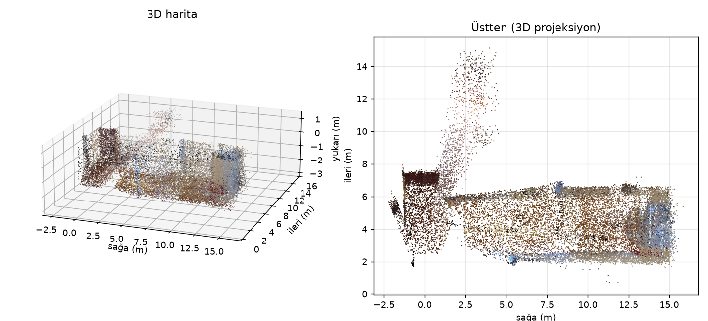

<div align="center">

# 🎥 Depth-Based Camera Motion Analyzer

**Tek bir monoküler videodan, IMU/GPS olmadan, kamera hareketini metre cinsinden 6-DoF olarak çıkarır.**

[Depth Anything V2](https://huggingface.co/depth-anything/Depth-Anything-V2-Metric-Indoor-Large-hf)
metrik derinlik + ORB eşleme + PnP RANSAC ile kareler arası poz çözülür; yörünge birikir
ve sonuç annotate videoya, grafiklere yazılır.

[](https://www.python.org/)
[](https://pytorch.org/)
[](https://huggingface.co/docs/transformers)
[](https://opencv.org/)


</div>

---

## 🎬 Demo

Ofis gezisi (natif portre 2176×3840 @ 60 fps, ~27 sn). Annotate özeti 3× hız, 5 fps, 280 px:

<div align="center">


</div>

**`demo.gif` — ofis çekiminin tamamı, seyrek karelerle.** Ne görünüyor:

| Bölge | Anlamı |
|:---|:---|
| **Renkli noktalar + kuyruk** | Her nokta ayrı bir özellik; rengi sabittir. Arkada kalan çizgi o noktanın **ekrandaki gerçek yoludur** (kare-kare Lucas-Kanade), iki uç arasında çekilmiş düz kiriş değildir. |
| **Sol üst yazılar** | Kare numarası ve o ana kadar biriken metre: `ileri` / `saga` / `yukari`. |
| **Sol alt kare (minimap)** | Kuş bakışı yörünge + **gri occupancy** (kabaca duvar). **Yeşil** = çekimin başlangıcı, **kırmızı** = kameranın şu anki yeri, beyaz/renkli çizgi = gidilen yol. Duvar hücreleri o ana kadar birikir. |
| **Sağ alt etiket** | O anki baskın öteleme veya dönüş: İLERİ, SAĞA DÖN, vb. |

<div align="center">

</div>

**`plot.png` — ofis gezisinin 2D özeti.** Ne görünüyor:

| Panel | Anlamı |
|:---|:---|
| **Üstten görünüm** (sol) | Dünya düzlemi: yatay **sağa (m)**, dikey **ileri (m)**. Gri ızgara kabaca duvar; yeşil başlangıç, kırmızı bitiş, çizgi yol. L koridor bu düzlemde okunur. |
| **Yükseklik profili** (sağ) | Adım adım **yukarı (m)**. El kamerasının salınımı burada okunur. |
| **Başlık** | `net` = başlangıç–bitiş kuş uçuşu mesafe. `yol` = odometre (gidilen toplam yol). |

<div align="center">

</div>

**`map_preview.png` — aynı koşunun 3D haritası.** Ne görünüyor:

| Panel | Anlamı |
|:---|:---|
| **3D harita** (sol) | Keyframe derinlikleri `T_wc` ile dünyaya basılır (`map.ply`). Tavan (`up_max=1.2` m, ilk kare göz=0) kesilir ki iç mekân görünsün. |
| **Üstten projeksiyon** (sağ) | Aynı bulutun kuş bakışı; 2D occupancy’den bağımsız, renk videodan gelir. |

Asıl teslim dosyası `Result/<ad>/<ad>.mp4` (H.264, kaynak FPS). `Result/<ad>/frames/` ham kare önbelleğidir; çıktı değildir.

---

## 📌 Ne Yapar?

Klasik optik akış 2B piksel kaymasına bakar ve sahne hareketi ile kamera hareketini karıştırır.
Bu sistem **metrik derinlikle 3B nokta** kurar, sonraki karedeki 2B izdüşümden `solvePnPRansac`
ile pozu çözer ve metre cinsinden biriktirir.

Çıktı kategorik etiket değil: **ileri / sağa / yukarı metre**, kümülatif yörünge ve anlık yön.

> Kamera ileri giderse derinlik azalır ve PnP `+z` ötelemesi üretir. Sağa kayınca noktalar
> sola kayar; bu, bölge ortalaması sezgisinden bağımsız geometrik bir ölçüdür.

### Anlık yön (videodaki etiket)

| Yön | Ekrandaki renk | Anlamı |
|:---|:---|:---|
| **İLERİ** | 🟢 Yeşil | Kamera sahneye yaklaşıyor (`+z`) |
| **GERİ** | 🔴 Kırmızı | Kamera sahneden uzaklaşıyor |
| **SAĞA** | 🔵 Mavi | Kamera sağa öteleniyor (`+x`) |
| **SOLA** | 🩵 Cyan | Kamera sola öteleniyor |
| **YUKARI** | 🟣 Magenta | Kamera yukarı öteleniyor (`−y`, OpenCV) |
| **AŞAĞI** | 🟡 Sarı | Kamera aşağı öteleniyor |
| **DURAGAN** | ⚪ Gri | Bu adımda baskın öteleme yok |

Bunlar 3 öteleme ekseni × 2 yön. Dönme (pan / tilt / roll) pozun içinde çözülür ama
etiket olarak ayrıştırılmaz — bkz. [Bilinen Sınırlamalar](#-bilinen-sınırlamalar).

---

## ⚙️ Nasıl Çalışır?

```
video (her format)
   → normalize     PNG kare + manifest (dönme uygulanır, K güncellenir)
   → metrik derinlik   Depth-Anything V2 Indoor/Outdoor (önbellekli, metre)
   → ORB eşleme → geri izdüşüm → PnP RANSAC → ΔT
   → yörünge birikimi + occupancy (kuş bakışı duvar ızgarası)
   → trajectory.json + occupancy.npz + plot.png + annotated.mp4 (H.264)
   → map.ply + map_preview.png (3D nokta bulutu, aynı koşuda)
```

1. **Normalizasyon.** ffprobe + ffmpeg; `rotate` etiketi açıkça uygulanır. Kareler kayıpsız PNG.
2. **Metrik derinlik.** Varsayılan `Indoor-Large`. Her kare modele bir kez girer; sonuç disk önbelleğinde.
3. **Poz.** Kaynak karenin 3B noktaları + hedef karenin 2B eşleşmeleri → `solvePnPRansac`.
4. **Birikim.** Odometre (adımların toplamı) ile net yer değiştirme (başlangıç–bitiş) ayrı tutulur.
5. **Görselleştirme.** Yön HUD’u yörüngeden; nokta izleri Lucas-Kanade; minimap’te o ana kadar biriken occupancy.
6. **Occupancy.** Her keyframe derinliği `T_wc` ile dünya xz’ye (sağa, ileri) basılır; 10 cm hücre, kamera-yüksekliği dilimi. Döngü kapatma yok.
7. **3D harita.** Aynı derinlik + pozlar dünya xyz’ye basılır → `map.ply` ve `map_preview.png`. `--no-map` ile kapatılır.

---

## 🚀 Kurulum

```bash
git clone https://github.com/Erenosxx/Depth-Based-Camera-Motion-Analyzer.git
cd Depth-Based-Camera-Motion-Analyzer

python -m venv .venv && source .venv/bin/activate
pip install -r requirements.txt
```

> 💡 `torch`'u kendi CUDA sürümünüze göre kurun:
> [pytorch.org/get-started/locally](https://pytorch.org/get-started/locally/)
> Ayrı bir sanal ortam kullanın; başka projelerin ortamına paket kurmayın.

Metrik Indoor/Outdoor checkpoint’leri ilk çalışmada Hugging Face’den iner.
`ffmpeg` / `ffprobe` annotate video (H.264) için gerekli.

Makineye özel yorumlayıcı yolu (conda yolu, `VIRTUAL_ENV` çakışması vb.) **repoya yazılmaz.**
Bir kez kopyalayıp kendi değerlerinizi girin:

```bash
cp local.env.example local.env
# local.env örneği (temsili — gerçek yolunuz farklı olur):
#   DCMA_PYTHON=/path/to/envs/dcma/bin/python
```

`local.env` `.gitignore`’dadır.

---

## 🧪 Kullanım

Ham videolar `Data/`, işlenmiş çıktılar `Result/` altına gider (ikisi de git’te yok).

Sanal ortam zaten aktifse:

```bash
PYTHONPATH=src python -m dcma.cli \
  --video "Data/girdi.mp4" \
  --out "Result/calisma_adi" \
  --scene indoor \
  --size large \
  --interval 0.15 \
  --max-edge 768
```

`local.env` tanımlıysa aynı çağrı sarmalayıcıyla (yorumlayıcı yolu dışarı sızmaz):

```bash
./Scripts/dcma.sh -m dcma.cli \
  --video "Data/girdi.mp4" \
  --out "Result/calisma_adi" \
  --scene indoor \
  --size large \
  --interval 0.15 \
  --max-edge 768
```

`--scene indoor|outdoor` zorunlu (`auto` henüz yok). Konsolda odometre, net yer değiştirme
ve atlanan kare sayısı basılır. Aynı komut `map.ply` + `map_preview.png` üretir
(`--no-map` ile kapatılır).

`--yaw-scale` (varsayılan `0.88`) PnP yaw’ı küçültür; `1.0` ham. `--up-max` (varsayılan `1.2` m)
3D haritada tavanı keser (ilk kare göz hizası = 0). 2D occupancy kameraya `0.8` m’den yakın
hit’leri, görüntü ortasını ve kare medyanından çok daha yakın derinlikleri atar.

Eski V2 `Result/` yanlış `K` taşıyabilir; 3D harita için VO’yu V3’te yeniden koşun.

Yalnızca haritayı yenilemek (VO yok):

```bash
./Scripts/dcma.sh -m dcma.map.build --run Result/calisma_adi --voxel 0.03
```

Yalnızca görseli yenilemek (derinlik tekrar çalışmaz):

```bash
./Scripts/dcma.sh -m dcma.viz.annotate --run Result/calisma_adi
```

Eski 3×3 sezgisel yöntem tarihsel referans olarak duruyor: `Scripts/legacy_distance_4_2.py`.
Metre üretmez.

---

## 📤 Çıktı

| Dosya | İçerik |
|:---|:---|
| `Result/<ad>/<ad>.mp4` | Asıl teslim: H.264, kaynak FPS, iz + HUD + minimap |
| `Result/<ad>/annotated.mp4` | Aynı video, koşu klasöründe |
| `Result/<ad>/trajectory.json` | Adım adım metre, atlanan kareler, `poses` (4×4 `T_wc`) |
| `Result/<ad>/plot.png` | Üstten yörünge + occupancy + yükseklik |
| `Result/<ad>/occupancy.npz` | Kabaca duvar ızgarası (hit’ler + kare indeksi) |
| `Result/<ad>/occupancy.png` | Aynı haritanın kuş bakışı görüntüsü |
| `Result/<ad>/map.ply` | V3: birleşik renkli nokta bulutu (Blender / CloudCompare) |
| `Result/<ad>/map_preview.png` | Aynı bulutun 3D + üstten PNG önizlemesi |
| `Result/<ad>/map_meta.json` | voxel, kare sayısı, xyz sınırları |
| `Result/<ad>/preview.png` | Ortadaki kareden still (yerel; README’de GIF kullanılır) |
| `Result/<ad>/frames/` | Ara bellek PNG — çıktı değil |
| `Result/<ad>/depth_cache/` | Derinlik `.npy` önbelleği |

**Referans koşu (V3, `ofis_gezisi.mp4`):** 2176×3840 portre @ 60 fps, ~27 sn, 1637 kare,
`--max-edge 768 --interval 0.15`. 181 adım, 0 atlama. Yol 21.37 m, net |11.92| m
(ileri +3.74 m, sağa +11.28 m). Şeritmetre / TUM ile henüz doğrulanmadı.

---

## 🔬 Teknik Detaylar

| Bileşen | Değer |
|:---|:---|
| Derinlik | `Depth-Anything-V2-Metric-Indoor-Large-hf` (varsayılan) |
| Poz | ORB + `solvePnPRansac` + refine |
| Görselleştirme izi | Shi-Tomasi + Lucas-Kanade, noktaya özel renk |
| Video yazımı | ffmpeg `libx264` `yuv420p` (OpenCV `mp4v` FPS’i bozuyordu) |
| Minimap | Tüm yol + occupancy AABB; geri dönüşte görüş donar; kenar payı %8; kırmızı noktada bakış oku |
| Occupancy | 10 cm xz ızgarası, kamera-yüksekliği dilimi, yakın hit (`0.8` m) atılır, döngü kapatma yok |
| 3D harita | `map.ply` + `map_preview.png`; voxel 3 cm; tavan `up_max=1.2` m kesilir |
| Kamera ekseni | OpenCV: `+x` sağ, `+y` aşağı, `+z` ileri; HUD `yaw_deg<0` → SAĞA DÖN |

---

## ⚠️ Bilinen Sınırlamalar

Bu bir **araştırma prototipidir** (V3).

| # | Sınırlama | Neden / Etki |
|:--|:---|:---|
| 1 | **Ölçek modelden gelir** | Monoküler geometri mutlak metre veremez; Indoor checkpoint yanlı olabilir. TUM / şeritmetre henüz yok. |
| 2 | **`K` kaba** | Kalibrasyon yoksa yatay FOV 70° varsayılır. Yanlış `K` tüm metreyi çarpar. |
| 3 | **Yerinde dönüş** | HUD `SAĞA DÖN` / `SOLA DÖN` + bakış oku. `\|yaw\|≥8°` adımında öteleme atılır (cam sapmasını keser; yürüyerek keskin viraj o adımda mesafeyi kaybeder). Yana kaymada sahte ileri sıfırlanır. `--yaw-scale` 0.88 sezgiseldir, kalibrasyon değil. Minimap AABB kırmızıyı çerçevede tutar. Döngü kapatma yok. |
| 4 | **Keyframe yok** | Sabit zaman aralığı (`--interval`). Çok yavaş/hızlı harekette eşleme zayıflar. |
| 5 | **Sağlamlık kapıları eksik** | Essential-matrix çapraz kontrolü ve hız kapısı henüz yok. |
| 6 | **Çözünürlük** | `--max-edge` küçültmesi görseli ve `K`’yı değiştirir. |
| 7 | **Harita kroki, CAD değil** | Occupancy Depth-Anything + PnP drift’e bağlı. Döngü kapatma yok: geri dönünce duvarlar kayabilir. Masa/kapı da “duvar” hücresi olabilir. |
| 8 | **3D `map.ply` VO’yu miras alır** | Aynı `T_wc`. Yanlış FOV/`K` ile koşulmuş Result’ta 90° dönüş şişer. Tavan `up_max` (1.2 m) üstü kesilir; gerçek tavan geometrisi 3D’de yoktur. VGGT / döngü kapatma yok. |

---

## 🗺️ Yol Haritası

- [x] Metrik derinlik + PnP VO + `trajectory.json`
- [x] CLI, Data/Result ayrımı, H.264 annotate, minimap
- [x] Kabaca duvar occupancy (minimap + plot + occupancy.npz)
- [x] 3D nokta haritası (`map.ply`, mevcut VO + derinlik)
- [ ] TUM RGB-D ATE/RPE + ölçek yanlılığı
- [ ] Paralaks keyframe + sağlamlık kapıları
- [x] Dönme (pan) HUD + minimap bakış oku
- [ ] Kontrollü şeritmetre çekimi (%10 hedef)

---

## 🧭 Projenin Evrimi

| Deneme | Yaklaşım | Sonuç |
|:--|:---|:---|
| **1** | Lucas-Kanade + grid (Gradio) | Kamera vs nesne ayrımı yok |
| **2** | 6 yön + zoom, kümülatif eşikler | Sahneye aşırı duyarlı |
| **3** | JPG kare dışa aktarma | Yöntem değişmedi |
| **4** | Göreli Depth Anything + 3×3 bölge farkı | Yön etiketi var, metre yok, ~%65 BELİRSİZ |
| **5 (V1)** | **Metrik derinlik + PnP görsel odometri** | Metre + yörünge + annotate video |
| **6 (V2)** | **Occupancy ızgarası (kuş bakışı duvar)** | Minimap/plot’ta kabaca duvar; döngü kapatma yok |
| **7 (V3)** | **3D `map.ply` + uzun kenar FOV** | Videodaki kareler dünya bulutuna basılır; portre `K` şişmesi kapatıldı |

Kilit içgörü aynı: **2B kaymayı sınıf etiketine çevirmek yerine 3B yapıyı ölçmek.**
V2 bunu kaba bir kat planına da bağlar.

---

## 📂 Proje Yapısı

```
Depth-Based-Camera-Motion-Analyzer/
├── Data/                     # ham videolar (repoya girmez)
├── Result/                   # işlenmiş çıktılar (repoya girmez)
├── Scripts/
│   ├── dcma.sh               # local.env'deki yorumlayıcıyla çalıştırır
│   ├── legacy_distance_4_2.py
│   └── make_demo_gif.sh
├── src/dcma/                 # metrik VO + görselleştirme + occupancy + 3D map
├── tests/
├── docs/
├── assets/
│   ├── demo.gif              # README: ofis gezisi annotate GIF’i
│   ├── plot.png              # README: 2D yörünge + occupancy
│   └── map_preview.png       # README: 3D harita önizlemesi
├── local.env.example         # kopyalayıp local.env yapın (git'e girmez)
├── README.md
├── pyproject.toml
└── requirements.txt
```

> 📦 Ham video ve koşu çıktıları `.gitignore`’da. README görselleri `assets/` istisnası.

---

<div align="center">
<sub>Bilgisayarla görü / monoküler metrik görsel odometri üzerine bir araştırma çalışması. V3.</sub>
</div>
